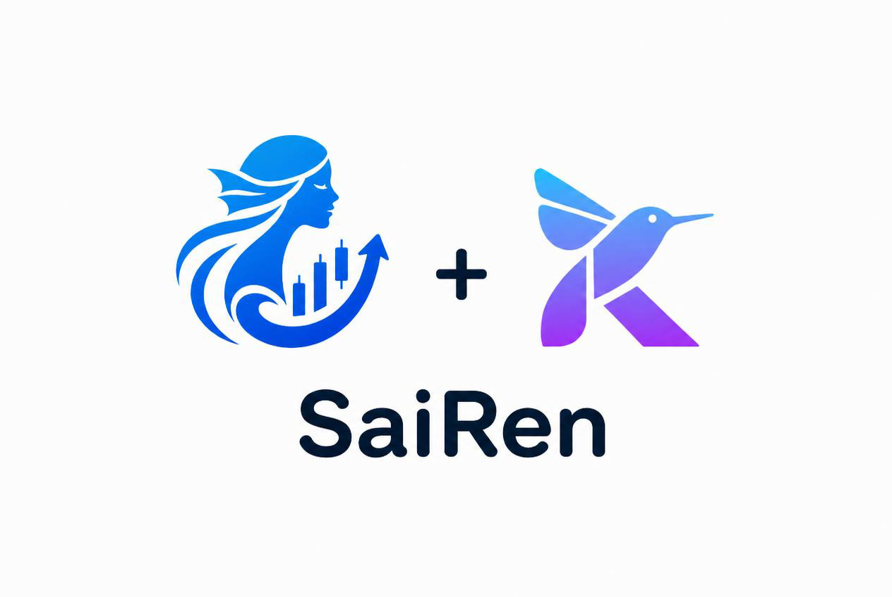
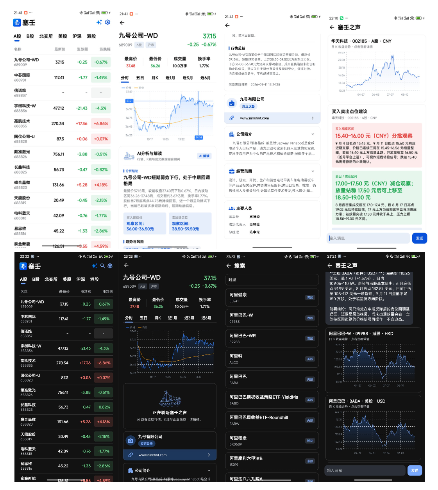
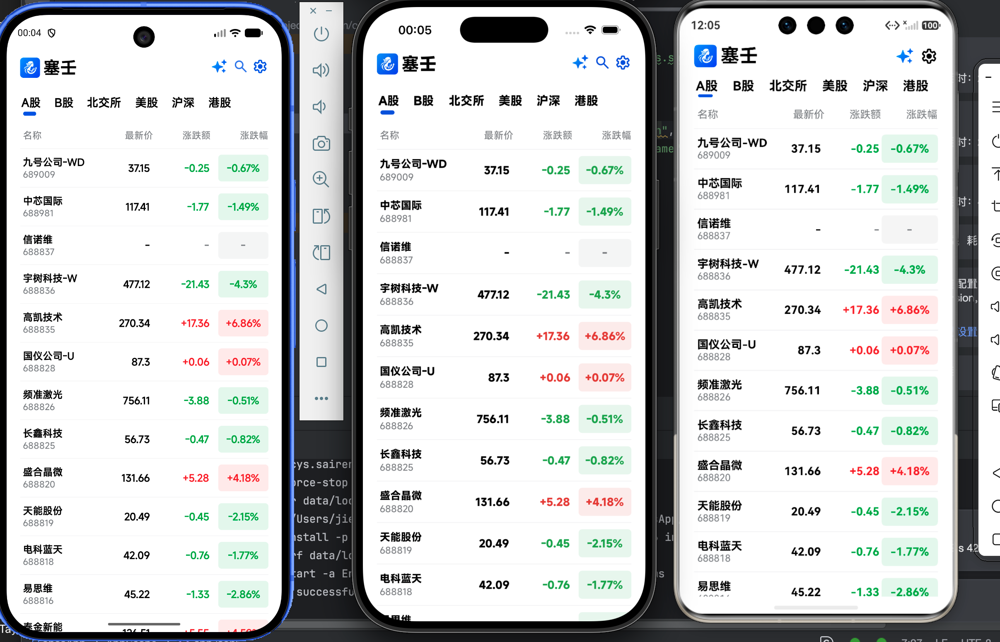

# SaiRen



SaiRen 是一个面向股票行情与 AI 分析场景的跨端应用示例。项目使用 Kotlin Multiplatform + Kuikly 共享业务与界面代码，同时提供 Android、iOS、H5、微信小程序和 OpenHarmony 端实现。应用支持行情浏览、股票搜索、股票详情、AI 对话、K 线展示、公司资料和个性化设置。

## 预览


### 多平台


已对Android、IOS、鸿蒙平台进行测试。

### 视频
[SaiRen 演示视频（约 10 MB）](https://drive.misakamoe.com/d/TB_drive/BILIShared/2026/%E8%A7%86%E9%A2%91/SaiRen%E6%BC%94%E7%A4%BA.mp4)

该链接用于下载预览视频。由于跨域限制，浏览器中可能无法直接在线播放；如无法播放，请点击链接下载后观看。

## 项目简介

SaiRen 将行情数据、股票分析和自然语言交互放在同一个跨端产品中：用户可以查看股票详情和日 K，也可以直接询问 AI 某只股票的行情、趋势、风险或买卖观察区间。AI 返回的内容采用可组合消息结构，前端能够渲染普通文本、Markdown、股票基本信息、K 线和推荐卡片。

### 技术栈

- **客户端**：Kotlin、Kotlin Multiplatform、Kuikly、Compose DSL
- **平台端**：Android、iOS、Web/H5、微信小程序、OpenHarmony
- **网络与数据**：Ktor/统一网络封装、Kotlinx Serialization、跨端缓存
- **后端**：Node.js 22、Hono、Drizzle ORM、SQLite、Zod
- **AI 与行情**：DeepSeek API、东方财富行情接口，A 股支持腾讯行情备用源
- **图表与渲染**：共享 K 线模块、SVG 资源渲染、平台图片适配
- **工程化**：Gradle Kotlin DSL、pnpm、Node.js 原生测试

## 快速开始

### 1. 环境

- JDK 17+
- Android Studio（Android 端）
- Xcode（iOS 端）
- Node.js `>= 24`
- pnpm `>= 11`

### 2. 启动 AI 后端

后端位于 `static_server/serve`，负责登录、聊天、股票分析、行情拉取和 SQLite 持久化。

```bash
cd static_server/serve
cp .env.example .env
# 编辑 .env，至少填入 DEEPSEEK_API_KEY
pnpm install
pnpm dev
```

默认监听 `8017` 端口，数据库默认写入 `static_server/serve/data/sairen.db`。生产环境可使用 `pnpm start`。客户端设备需能访问开发机的 `8017` 端口。

主要配置项：

| 配置项 | 默认值 | 说明 |
| --- | --- | --- |
| `PORT` | `8017` | 服务端口 |
| `DEEPSEEK_API_KEY` | 无 | DeepSeek API Key |
| `DEEPSEEK_BASE_URL` | `https://api.deepseek.com` | AI 服务地址 |
| `DEEPSEEK_MODEL` | `deepseek-flash` | 使用的模型 |
| `DATABASE_PATH` | `./data/sairen.db` | SQLite 文件路径 |
| `AUTH_TOKEN_TTL_SECONDS` | `2592000` | 登录 token 有效期 |

启动后可调用 `POST /v1/auth/register` 注册，使用 `POST /v1/auth/login` 登录；聊天接口需要携带 `Authorization: Bearer <token>`。股票分析接口为 `POST /v1/stock-analyses`：

```json
{ "code": "600519", "marketCode": "1" }
```

完整接口、缓存策略、行情降级策略和 AI 卡片协议见 [后端说明](static_server/serve/README.md)。

### 3. 运行客户端

```bash
./gradlew :androidApp:assembleDebug
```

Android 工程位于 `androidApp`；iOS 工程位于 `iosApp`；H5 和小程序分别位于 `h5App`、`miniApp`；OpenHarmony 工程位于 `ohosApp`，使用 DevEco Studio 打开。

## 架构说明

项目采用“共享业务与 UI + 平台适配层 + 独立 AI 服务”的分层结构：

```text
SaiRen/
├── shared/                 # 跨端业务、页面、组件、主题和资源
├── core/
│   ├── common/              # 通用扩展、认证、主题、Bridge 模块
│   ├── network/             # 网络请求、序列化、响应模型和 Service
│   └── chart/               # 股票 K 线领域模型与图表能力
├── androidApp/              # Android 容器、Kuikly 适配器和原生模块
├── iosApp/                  # iOS 容器及原生扩展
├── h5App/                   # H5 入口和 Web 渲染适配
├── miniApp/                 # 微信小程序入口、WebView 和缓存模块
├── ohosApp/                 # OpenHarmony 应用工程
├── static_server/serve/     # Hono AI 分析后端
├── docs/                    # README 展示截图
└── buildSrc/                # Gradle 构建约定与依赖配置
```

- `shared/src/commonMain/.../ui`：首页、搜索、股票、登录、设置和 AI Agent 页面。
- `shared/src/commonMain/.../component`：聊天消息、屏幕状态和通用交互组件。
- `shared/src/commonMain/.../model`：股票、聊天、分析结果和页面状态模型。
- `shared/src/commonMain/.../theme`：颜色、排版、动态主题和浅色主题支持。
- `shared/src/commonMain/assets`：字体、SVG、图标、加载动画和业务图片资源。
- `core:common`：认证偏好、主题偏好、窗口尺寸、事件和跨平台 Bridge。
- `core:network`：统一请求入口、请求/响应模型、序列化器、错误转换和业务 Service。
- `core:chart`：K 线数据模型、绘制和跨端图表能力。

平台工程负责承载 Kuikly、注册平台模块、提供图片/字体/路由/线程等适配器，并处理平台特有的生命周期与原生能力。

## 设计亮点

### 统一封装的网络请求

`core:network` 统一处理请求构造、序列化、错误映射、超时和响应模型，业务层通过 Service 获取类型安全的数据。页面不需要重复编写平台请求代码，也便于统一处理鉴权和异常状态。

### MVI 页面状态

页面以 State、Intent、Reducer/Effect 组织交互：用户操作转成 Intent，状态变化集中输出到 UI，网络请求和导航等副作用通过 Effect 处理。加载、空数据、错误和成功状态边界清晰。

### AutoError 组件

AutoError 将网络错误、业务错误和空状态转换为统一反馈，提供重试入口和错误信息展示。页面只需提供请求状态和重试动作即可保持一致的错误体验。

### 动态主题与浅色模式

主题偏好通过 `core:common` 持久化，支持运行时切换和浅色主题。颜色、背景、文字层级集中管理，主题变化可以覆盖首页、聊天、股票详情和设置页面。

### AI 对话中的结构化渲染

AI 消息由 `text`、`markdown`、`stock_basic`、`stock_kline`、`stock_trade_timing`、`stock_company` 等内容块组成。同一段对话可以同时展示文字解读、实时行情、日 K 图、公司资料和买卖观察区间推荐卡片。

### SVG 与资源渲染

项目统一处理 SVG 图标、业务资源和不同平台的路径差异。常用图标、加载动画和页面插图放在共享 assets 中，减少平台重复维护。

### 全局 SRTextView 与字体体系

全局 `SRTextView` 统一文字的字体、字号、颜色、行高和字重，避免不同页面出现排版差异。项目内置 MiSans 字体资源，并通过字体适配器在各平台注册，保证股票数字、中文正文和 AI 内容在不同端保持一致。

### 跨端复用与原生扩展并存

页面、状态和领域模型尽量放在 shared；路由、图片、字体、分享、缓存和 Bridge 等能力通过平台模块注入，既保持跨端复用率，也保留各平台的原生扩展能力。

## 后端接口概览

| 能力 | 接口 |
| --- | --- |
| 注册 | `POST /v1/auth/register` |
| 登录 | `POST /v1/auth/login` |
| 当前用户 | `GET /v1/auth/me` |
| AI 聊天历史 | `GET /v1/chat/history` |
| 发送 AI 消息 | `POST /v1/chat/messages` |
| 股票分析 | `POST /v1/stock-analyses` |

后端会自行查询实时行情、公司资料和最近 120 根日 K；分析结果在一定时间内缓存，同一股票的并发分析会复用进行中的任务。所有接口统一返回 `code`、`data`、`msg` 三段式结构，便于客户端网络层统一解析。

## 开发与测试

```bash
./gradlew build
cd static_server/serve
pnpm test
```

## License

项目当前用于学习、研究和跨端架构实践，具体开源许可和第三方依赖许可请以仓库后续声明为准。
